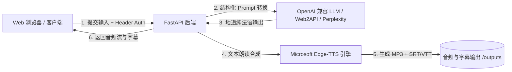

# French Audio Studio (法语音频工作台)

<p align="center">
  
  
  
  
  
</p>

[English](#english) | [中文说明](#中文说明)

---

<span id="中文说明"></span>

## 📖 项目简介

**French Audio Studio（法语音频工作台）** 是一套专为法语学习、口语练习及内容创作者设计的全流程工作台。系统结合了大语言模型（LLM）的语言处理能力与微软 Edge-TTS 高音质神经网络语音合成技术，实现从**想法/草稿/翻译 -> 地道法语文本 -> 录音级音频与同步字幕（SRT/VTT）**的一站式制作。

在线演示地址：[https://tts.gaoyuze.com/](https://tts.gaoyuze.com/)

---

## ✨ 核心特性

- 🧠 **智能文本处理（5 种处理模式）**：
  - **智能判断 (Auto)**：自动分析输入语言与意图，决定最适处理策略。
  - **按要求生成 (Generate)**：将提示词或指令直接创作出符合场景的法语文本。
  - **忠实翻译 (Translate)**：忠实传达原文信息，不偏离、不擅自扩写。
  - **自然表达 (Express)**：将零散口述或中英夹杂的想法转化为地道自然的法语表达。
  - **润色法语 (Polish)**：修正现有法语的语法拼写与表达瑕疵，保留原意。
- 🎚️ **精细语言维度调节**：
  - **表达风格**：口语化 (Spoken)、标准 (Neutral)、书面化 (Formal)、写作润色 (Polished)。
  - **CEFR 难度分级**：A1-A2（基础）、B1-B2（中级）、C1-C2（高级）。
  - **地区方言**：法国法语 (`fr-FR`)、加拿大法语 (`fr-CA`)。
- 🎙️ **高自然度语音合成 (Edge-TTS)**：
  - 支持 Denise、Henri、Vivienne、Remy、Sylvie、Jean、Antoine 等高质量 Neural 声音。
  - 同步生成时间戳字幕文件（SRT / VTT）。
  - 支持一键导出 MP3 音频与 SRT 外挂字幕。
- 🔒 **隐私与安全第一**：
  - 后端无硬编码密钥，API Key 仅保存在浏览器本地（可选是否记住），通过请求头透传给后端转发。
- 📦 **轻量可移植**：
  - 基于 FastAPI + 原生现代化前端，无重型框架依赖，启动毫秒级，附带完整自动化测试。

---

## 🏗️ 架构概览



---

## 🚀 快速开始

### 方式一：Docker Compose（推荐）

1. **克隆项目**
   ```bash
   git clone https://github.com/BenjaminGao2025/french-audio-studio.git
   cd french-audio-studio
   ```

2. **配置环境变量（可选）**
   ```bash
   cp .env.example .env
   ```

3. **启动容器**
   ```bash
   docker compose up -d --build
   ```

4. 打开浏览器访问：`http://localhost:8000`

---

### 方式二：本地 Python 运行

1. **环境准备**（推荐 Python 3.11+）
   ```bash
   python3 -m venv .venv
   source .venv/bin/activate  # Windows: .venv\Scripts\activate
   pip install -r requirements.txt
   ```

2. **启动服务**
   ```bash
   python tts_service.py
   # 或使用 uvicorn 启动：
   # uvicorn tts_service:app --host 0.0.0.0 --port 8000 --reload
   ```

3. 打开浏览器访问：`http://localhost:8000`

---

## ⚙️ 环境变量说明

| 变量名 | 默认值 | 描述 |
| :--- | :--- | :--- |
| `OUTPUT_DIR` | `./outputs` | 音频及字幕输出保存目录 |
| `PERPLEXITY_BASE_URL` | `http://127.0.0.1:8002/v1` | OpenAI 兼容接口地址（支持 Web2API、本地网关等） |
| `PERPLEXITY_MODEL` | `grok-4.6` | 默认法语转换大语言模型（如 grok-4.6, sonar-2） |
| `PERPLEXITY_PROOFREAD_MODEL`| `gpt-5.6-terra` | 兜底纠错/校对模型 |
| `PERPLEXITY_TIMEOUT_SECONDS`| `120` | LLM 请求超时时间（秒） |
| `MAX_TEXT_CHARS` | `15000` | 单次输入最大字符限制 |

---

## 🧪 运行测试

项目内置完整的单元测试套件（覆盖端点认证、降级机制、音视频输出校验与容错处理）：

```bash
python -m unittest discover -s tests -p 'test_*.py'
```

---

<span id="english"></span>

## 🌐 English Overview

**French Audio Studio** is an all-in-one workbench tailored for French learners, communicators, and content creators. It seamlessly connects modern LLM intelligence with Microsoft Edge neural text-to-speech engine to transform ideas, drafts, and notes into authentic French text, paired with high-quality MP3 audio and synchronized SRT/VTT subtitles.

### Key Capabilities

- **Intelligent French Transformation**: Auto mode, direct generation, faithful translation, natural phrasing, and French polishing.
- **Expressive Nuance Controls**: 4 styles (spoken, neutral, formal, polished), 3 CEFR levels (A1-C2), and 2 dialects (France / Canada).
- **High-Fidelity Neural Speech**: Multiple edge-tts neural voices with subtitle sync and one-click download.
- **Privacy First**: Zero hardcoded secrets, client-side key storage, and full request-level security isolation.
- **Production-Ready**: FastAPI async backend, minimal native web interface, containerized with Docker.

---

## 📄 开源许可证

本项目采用 [MIT License](LICENSE) 许可证。
